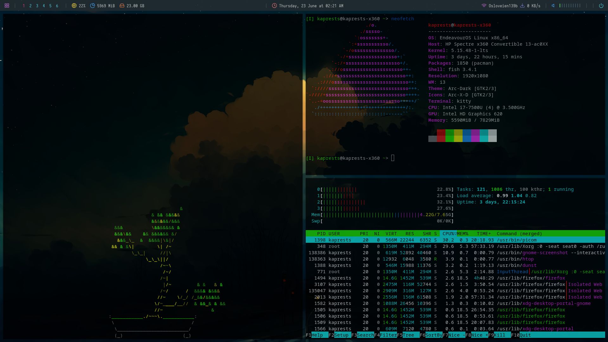

# dotfiles
My dotfiles

## Installation 
* clone as a bare repo:

    `git clone --bare https://github.com/kaprests/dotfiles.git $HOME/.dotfiles`

* set dotfiles alias: 

    `alias dots='/usr/bin/git --git-dir=$HOME/.dotfiles/ --work-tree=$HOME'`

* checkout the content from repo to $HOME: 

    `dots checkout`
    
* Hide undtracked files

    `dots config --local status.showUntrackedFiles no`

* Copy `.config/userChrome.css` to Firefix profile directory
    Have not yet worked out a simple way to automate this. 

Based on [this article](https://medium.com/toutsbrasil/how-to-manage-your-dotfiles-with-git-f7aeed8adf8b) at medium.com.

## Screenshots

